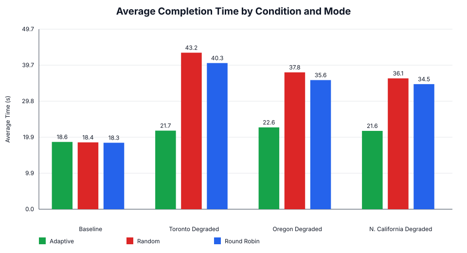
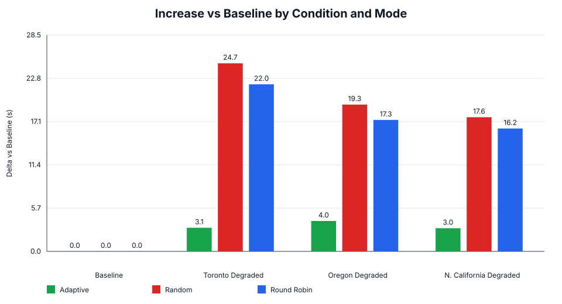

# Results Summary

Generated from the experiment CSV files in `results/`.

## Key Findings

- Baseline performance was close across all three modes; no mode dominated when all origins were healthy.
- Round Robin had the lowest baseline average completion time, but only by a small margin.
- Adaptive clearly won when Toronto was degraded, because it avoided the degraded origin.
- Adaptive clearly won when Oregon was degraded, again by shifting away from the impaired server.
- Adaptive clearly won when N. California was degraded, showing the same adaptive behavior.
- Random and Round Robin kept sending traffic to degraded origins, which caused 70s-99s request times on those paths.
- The main value of the adaptive selector is not baseline speed. It is avoiding bad paths under asymmetric network conditions.

## Graphs

## Overall Average Completion Time

| Condition | Adaptive | Random | Round Robin | Best |
|---|---:|---:|---:|---|
| Baseline | 18.569s | 18.446s | 18.341s | Round Robin |
| Toronto Degraded | 21.672s | 43.186s | 40.321s | Adaptive |
| Oregon Degraded | 22.571s | 37.756s | 35.630s | Adaptive |
| N. California Degraded | 21.617s | 36.096s | 34.504s | Adaptive |

## Degradation Penalty vs Baseline

| Condition | Adaptive Δ | Random Δ | Round Robin Δ |
|---|---:|---:|---:|
| Toronto Degraded | 3.104s | 24.740s | 21.980s |
| Oregon Degraded | 4.002s | 19.310s | 17.289s |
| N. California Degraded | 3.049s | 17.649s | 16.163s |

## Average Time by Client Count

| Condition | Mode | 1 Client | 5 Clients | 10 Clients |
|---|---|---:|---:|---:|
| Baseline | Adaptive | 2.438s | 13.958s | 22.487s |
| Baseline | Random | 2.417s | 11.368s | 23.588s |
| Baseline | Round Robin | 1.869s | 11.723s | 23.297s |
| Toronto Degraded | Adaptive | 4.345s | 11.739s | 28.372s |
| Toronto Degraded | Random | 2.137s | 56.904s | 40.432s |
| Toronto Degraded | Round Robin | 43.116s | 32.496s | 43.953s |
| Oregon Degraded | Adaptive | 5.821s | 15.918s | 27.572s |
| Oregon Degraded | Random | 45.641s | 41.092s | 35.300s |
| Oregon Degraded | Round Robin | 4.615s | 32.397s | 40.348s |
| N. California Degraded | Adaptive | 5.281s | 14.113s | 27.003s |
| N. California Degraded | Random | 7.706s | 25.167s | 44.399s |
| N. California Degraded | Round Robin | 4.536s | 40.231s | 34.638s |

## Selected Origin Breakdown from CSV Redirect Targets

| Condition | Mode | Selected Origins |
|---|---|---|
| Baseline | Adaptive | ncalifornia: 9 req, 22.404s avg; toronto: 7 req, 13.638s avg |
| Baseline | Random | ncalifornia: 5 req, 20.991s avg; oregon: 2 req, 21.388s avg; toronto: 9 req, 16.379s avg |
| Baseline | Round Robin | ncalifornia: 5 req, 19.080s avg; oregon: 6 req, 17.018s avg; toronto: 5 req, 19.191s avg |
| Toronto Degraded | Adaptive | oregon: 16 req, 21.672s avg |
| Toronto Degraded | Random | ncalifornia: 5 req, 18.361s avg; oregon: 5 req, 13.962s avg; toronto: 6 req, 88.227s avg |
| Toronto Degraded | Round Robin | ncalifornia: 5 req, 15.582s avg; oregon: 5 req, 14.730s avg; toronto: 6 req, 82.261s avg |
| Oregon Degraded | Adaptive | toronto: 16 req, 22.571s avg |
| Oregon Degraded | Random | ncalifornia: 5 req, 26.054s avg; oregon: 5 req, 71.238s avg; toronto: 6 req, 19.607s avg |
| Oregon Degraded | Round Robin | ncalifornia: 6 req, 14.838s avg; oregon: 5 req, 81.121s avg; toronto: 5 req, 15.090s avg |
| N. California Degraded | Adaptive | toronto: 16 req, 21.617s avg |
| N. California Degraded | Random | ncalifornia: 5 req, 78.169s avg; oregon: 10 req, 17.305s avg; toronto: 1 req, 13.640s avg |
| N. California Degraded | Round Robin | ncalifornia: 5 req, 82.728s avg; oregon: 6 req, 11.855s avg; toronto: 5 req, 13.459s avg |

## JSONL Notes

- The `.jsonl` files in `results/` are useful supporting evidence for selector decisions, metrics, and event types.
- They are not perfectly isolated per run because `collect_logs.sh` tails the last 5000 lines from the shared live selector log.
- For report-quality quantitative comparisons, the CSV files are the cleaner source of truth.

## Source Files

### Baseline

- [adaptive_baseline.csv](/Users/anguscheng/Desktop/multimedia-src-selection/results/adaptive_baseline.csv)
- [adaptive_baseline.jsonl](/Users/anguscheng/Desktop/multimedia-src-selection/results/adaptive_baseline.jsonl)
- [random_baseline.csv](/Users/anguscheng/Desktop/multimedia-src-selection/results/random_baseline.csv)
- [random_baseline.jsonl](/Users/anguscheng/Desktop/multimedia-src-selection/results/random_baseline.jsonl)
- [round_robin_baseline.csv](/Users/anguscheng/Desktop/multimedia-src-selection/results/round_robin_baseline.csv)
- [round_robin_baseline.jsonl](/Users/anguscheng/Desktop/multimedia-src-selection/results/round_robin_baseline.jsonl)

### Toronto Degraded

- [adaptive_toronto_degraded.csv](/Users/anguscheng/Desktop/multimedia-src-selection/results/adaptive_toronto_degraded.csv)
- [adaptive_toronto_degraded.jsonl](/Users/anguscheng/Desktop/multimedia-src-selection/results/adaptive_toronto_degraded.jsonl)
- [random_toronto_degraded.csv](/Users/anguscheng/Desktop/multimedia-src-selection/results/random_toronto_degraded.csv)
- [random_toronto_degraded.jsonl](/Users/anguscheng/Desktop/multimedia-src-selection/results/random_toronto_degraded.jsonl)
- [round_robin_toronto_degraded.csv](/Users/anguscheng/Desktop/multimedia-src-selection/results/round_robin_toronto_degraded.csv)
- [round_robin_toronto_degraded.jsonl](/Users/anguscheng/Desktop/multimedia-src-selection/results/round_robin_toronto_degraded.jsonl)

### Oregon Degraded

- [adaptive_oregon_degraded.csv](/Users/anguscheng/Desktop/multimedia-src-selection/results/adaptive_oregon_degraded.csv)
- [adaptive_oregon_degraded.jsonl](/Users/anguscheng/Desktop/multimedia-src-selection/results/adaptive_oregon_degraded.jsonl)
- [random_oregon_degraded.csv](/Users/anguscheng/Desktop/multimedia-src-selection/results/random_oregon_degraded.csv)
- [random_oregon_degraded.jsonl](/Users/anguscheng/Desktop/multimedia-src-selection/results/random_oregon_degraded.jsonl)
- [round_robin_oregon_degraded.csv](/Users/anguscheng/Desktop/multimedia-src-selection/results/round_robin_oregon_degraded.csv)
- [round_robin_oregon_degraded.jsonl](/Users/anguscheng/Desktop/multimedia-src-selection/results/round_robin_oregon_degraded.jsonl)

### N. California Degraded

- [adaptive_ncalifornia_degraded.csv](/Users/anguscheng/Desktop/multimedia-src-selection/results/adaptive_ncalifornia_degraded.csv)
- [adaptive_ncalifornia_degraded.jsonl](/Users/anguscheng/Desktop/multimedia-src-selection/results/adaptive_ncalifornia_degraded.jsonl)
- [random_ncalifornia_degraded.csv](/Users/anguscheng/Desktop/multimedia-src-selection/results/random_ncalifornia_degraded.csv)
- [random_ncalifornia_degraded.jsonl](/Users/anguscheng/Desktop/multimedia-src-selection/results/random_ncalifornia_degraded.jsonl)
- [round_robin_ncalifornia_degraded.csv](/Users/anguscheng/Desktop/multimedia-src-selection/results/round_robin_ncalifornia_degraded.csv)
- [round_robin_ncalifornia_degraded.jsonl](/Users/anguscheng/Desktop/multimedia-src-selection/results/round_robin_ncalifornia_degraded.jsonl)
